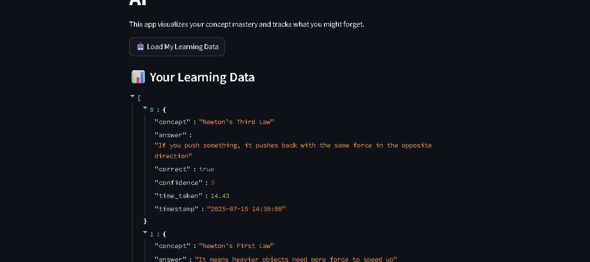

# 🧠 Personalized Cognitive Learning AI

A cognitive learning companion that tracks how well you understand key concepts, how confident you are, and how quickly you respond — built to boost personalized learning and memory retention. Designed to mimic how human memory fades and reinforces concepts over time.

---

### 🔥 Features
- 🧠 Tracks concepts, answers, confidence, time taken, and timestamps
- 📊 Visualizes personalized learning data in a clean UI
- 🗂️ Saves responses per user (`user_data/<username>_responses.json`)
- 🌐 Live deployment on Render
- 💻 Built with Python, Streamlit

---

### 📸 Live App Preview



---

### 🚀 Try It Live

🔗 [Launch App](https://cognitive-learning-ai.onrender.com)

---

### 🧠 What It Does

This app builds a personal knowledge profile by:
- Asking concept-level questions
- Tracking your confidence, accuracy, and speed
- Detecting weak areas based on your responses
- Helping you revise what you’re about to forget

---

### 📁 Project Structure

cognitive-learning-ai/
├── app.py
├── user_data/
│ └── riz_responses.json
├── assets/
│ └── cognitive_app_screenshot_cropped.png
├── requirements.txt
└── README.md

yaml
Copy
Edit

---

### 💻 Technologies Used

- Python
- Streamlit
- JSON data storage
- Git + GitHub
- Deployed on Render

---

### 🧾 How to Run Locally

```bash
git clone https://github.com/aurafrezra/cognitive-learning-ai.git
cd cognitive-learning-ai
pip install -r requirements.txt
streamlit run app.py
💡 Inspiration & Vision
This project was built as part of my MIT portfolio to showcase a new way to learn: not just by repetition, but by understanding and prediction — modeling how our brain forgets and reinforces concepts.

🙌 Created By
Built with 💻 and 🚀 by @aurafrezra
MIT Hopeful | AI Innovator

📌 License
This project is open-source under the MIT license.

yaml
Copy
Edit

---

### ✅ Final Step:
Make sure your screenshot is located in:
assets/cognitive_app_screenshot_cropped.png

kotlin
Copy
Edit

And then paste this `README.md` content directly on GitHub.

Want a PDF version of this for your MIT application too? Just say the word 💼
